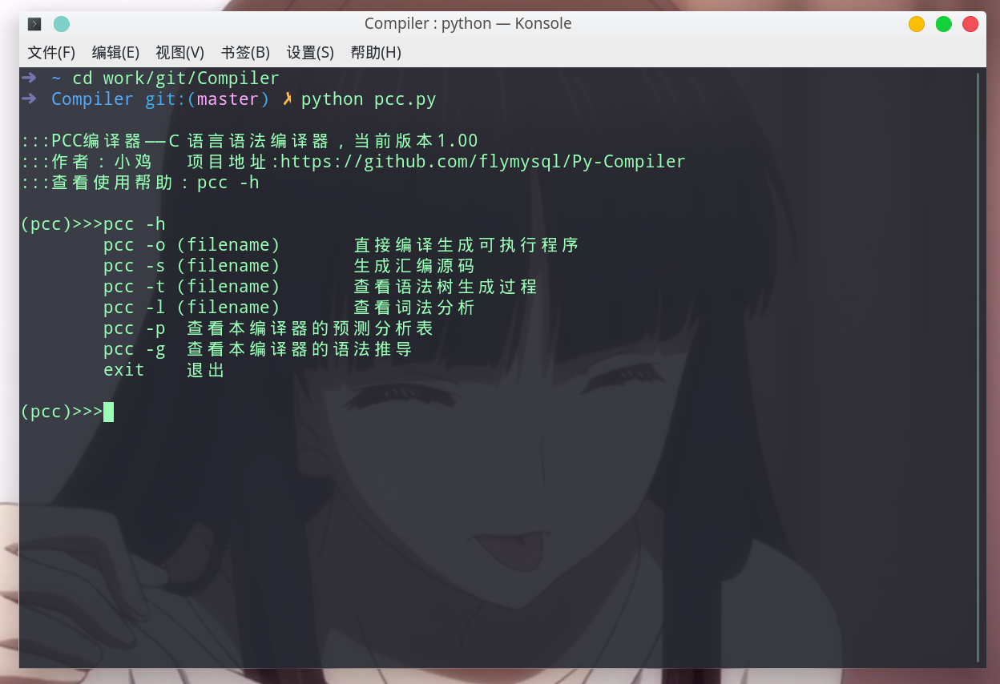
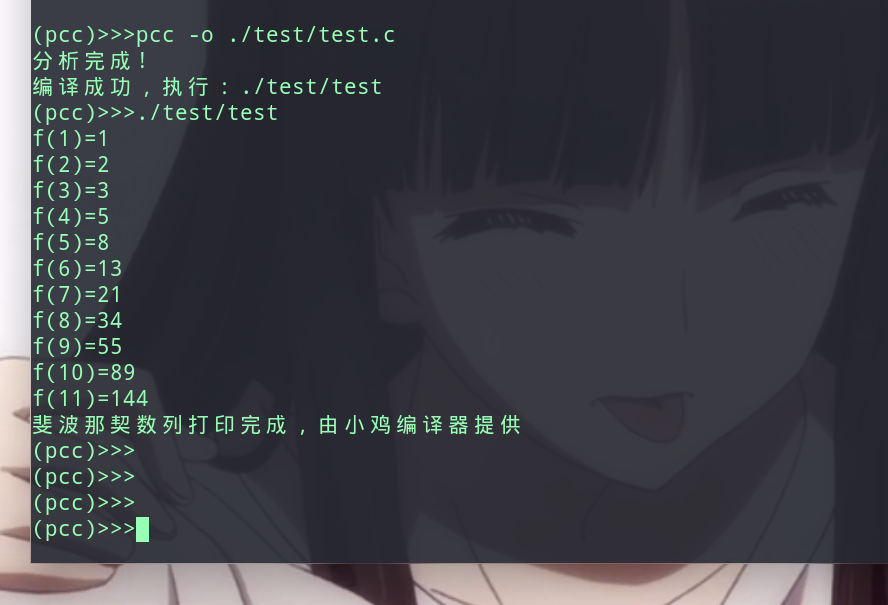

## PCC——python实现编译器

编译原理课设，实现源码到汇编代码的翻译，链接部分使用gcc的功能

## 源码说明

1. lexer.py     词法分析器
2. get_predict_table.py     生成预测分析表
3. LR.py        非递归的语法分析器
4. generate.py  中间代码生成
5. to_asm.py    汇编代码生成
6. pcc.py       入口函数

## 使用

```python
$ python pcc.py
```

**命令说明**

```
pcc -o (filename)       直接编译生成可执行程序
pcc -s (filename)       生成汇编源码
pcc -t (filename)       查看语法树生成过程
pcc -l (filename)       查看词法分析
pcc -h                  查看帮助
pcc -p                  查看本编译器的预测分析表
pcc -g                  查看本编译器的语法推导
exit                    退出
```



### 编译代码

```
pcc -o ./test/test.c
```


**ｃ语言源码**

```c

// 兰州小红鸡的注释测试
int main(){
    int arr[25];
    int index = 0;
    // 求０～２０的斐波那契数列
    arr[0] = 1;
    arr[1] = 2;
    arr[2] = 3;
    while(index < 10*2 ){
        int b = arr[index];
        arr[index+2]=arr[index+1] + b;
        printf("f(%d)=%d\n",index,b);
        index = index +1;
    }
    printf("完成斐波那契数列打印！由小鸡编译器提供——pcc\n");
}
```

**生成的中间代码（四元式）**

```
(=,0,0,index)
(=,1,0,arr[]0)
(=,2,0,arr[]1)
(=,3,0,arr[]2)
(code_block,0,0,W4)
(j<,index,20,code6)
(j,0,0,block6)
(code_block,0,0,code6)
(=,arr[]index,0,b)
(+,index,1,T0)
(+,arr[]T0,b,T1)
(+,index,2,T2)
(=,T1,0,arr[]T2)
(print,index,b,-1)
(+,index,1,T3)
(=,T3,0,index)
(j,0,0,W4)
(code_block,0,0,block6)
(print,-1,-1,-1)
```

**生成的汇编代码**

```s
	.text
	.section	.rodata
	.comm	T0,4,4
	.comm	T1,4,4
	.comm	T2,4,4
	.comm	T3,4,4
.LC0:
	.string "f(%d)=%d\n"
.LC1:
	.string "完成斐波那契数列打印！由小鸡编译器提供——pcc\n"
	.text
	.globl	main
	.type	main, @function
main:

	.cfi_startproc
	pushq	%rbp
	.cfi_def_cfa_offset 16
	.cfi_offset 6, -16
	movq	%rsp, %rbp
	.cfi_def_cfa_register 6
	subq	$120, %rsp
	movl	$0, -8(%rbp)
	movl	$0, -12(%rbp)
	movl	$1, -112(%rbp)
	movl	$2, -108(%rbp)
	movl	$3, -104(%rbp)
.W5:
	movl	-12(%rbp), %eax
	cmpl	$20, %eax
	jle	.code7
	jmp	.block7
.code7:
	movl	-12(%rbp), %eax
	cltq
	movl	-112(%rbp, %rax, 4), %ecx
	movl	%ecx, -8(%rbp)
	movl	-12(%rbp), %edx
	movl	$1, %eax
	addl	%edx, %eax
	movl	%eax, T0(%rip)
	movl	T0(%rip), %eax
	cltq
	movl	-112(%rbp, %rax, 4), %edx
	movl	-8(%rbp), %eax
	addl	%edx, %eax
	movl	%eax, T1(%rip)
	movl	-12(%rbp), %edx
	movl	$2, %eax
	addl	%edx, %eax
	movl	%eax, T2(%rip)
	movl	T2(%rip), %eax
	cltq
	movl	T1(%rip), %ecx
	movl	%ecx, -112(%rbp, %rax, 4)
	movl	-12(%rbp), %eax
	movl	-8(%rbp), %edx
	movl	%eax, %esi
	leaq	.LC0(%rip), %rdi
	movl	$0, %eax
	call	printf@PLT
	movl	-12(%rbp), %edx
	movl	$1, %eax
	addl	%edx, %eax
	movl	%eax, T3(%rip)
	movl	T3(%rip), %ecx
	movl	%ecx, -12(%rbp)
	jmp	.W5
.block7:
	movl	%eax, %esi
	leaq	.LC1(%rip), %rdi
	movl	$0, %eax
	call	printf@PLT

	movl	$0, %eax
	leave
	.cfi_def_cfa 7, 8
	ret
	.cfi_endproc
.LFE6:
	.size	main, .-main
	.ident	"PCC: 1.0.0"

```

其他命令自行发觉hhh